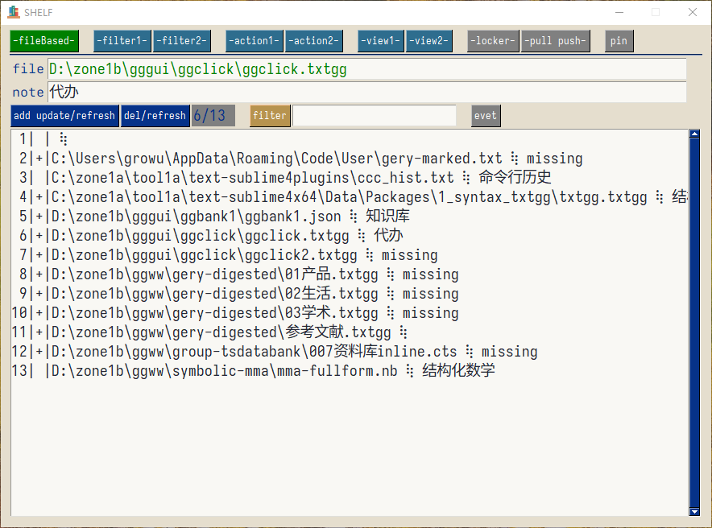
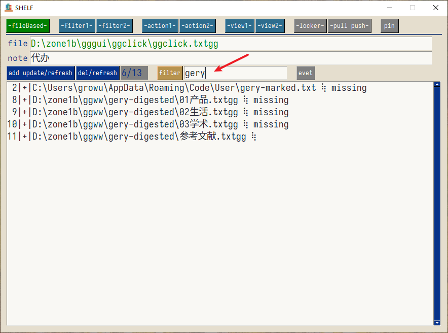
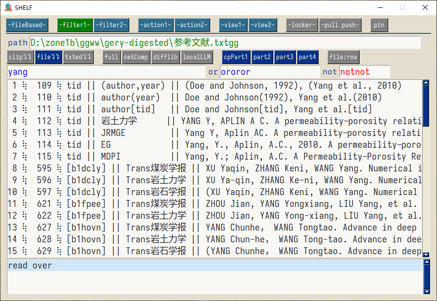
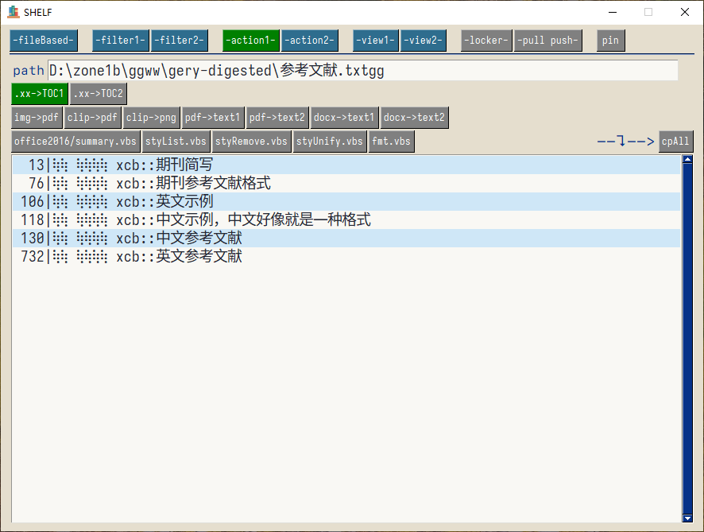
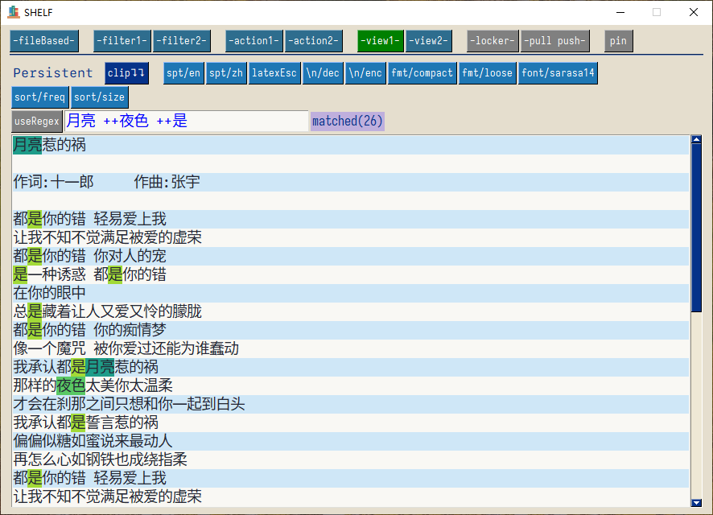
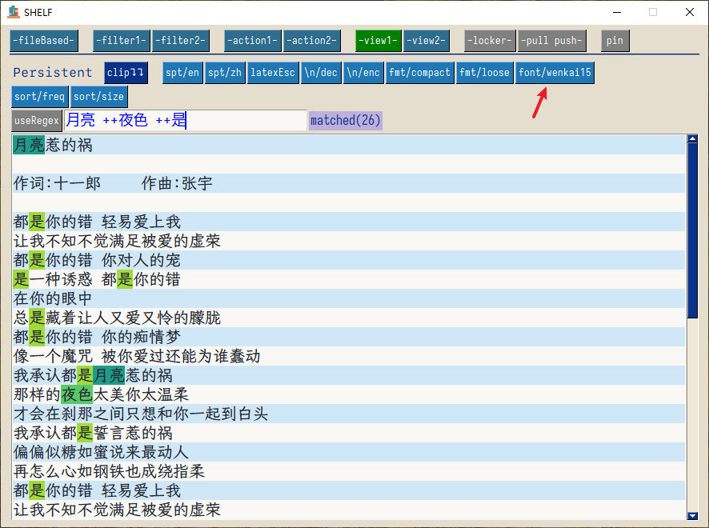
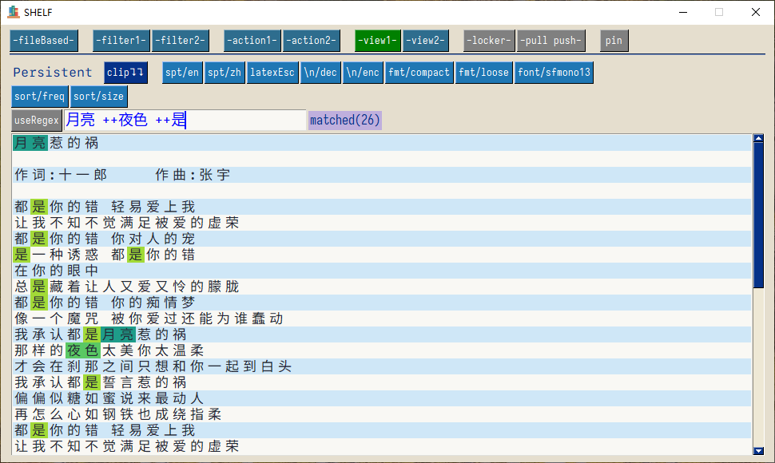

<!--  2024-10-17(Thu) -->

# ggshelf

一个文件追踪、内容搜索、文字处理工具

### 功能

#### 文件汇总面板

文件追踪。这个功能主要是为了提醒自己重要文件，不需要的文件应该及时删除。这里不是文件仓库。

- 文件添加
- 文件删除
- 文件备注
- 文件过滤
- 文件存在性检测
- 可以临时存储其他需要提醒的内容

#### 文件内容检索面板

- 检索文件内容
- 根据选择文本行，进行处理

#### 文件内容处理面板

根据自己的需要添加的一些功能

- 提取文件的大纲目录
- pdf文件和docx文件内容提取
- 文件内容的格式化

#### 内容阅读(分析)面板

对纯文本进行分析

- 高亮显示，可选正则匹配
- 词频统计等
- 字体选择

### 安装

从`release`下载压缩文件，解压到任意文件夹，双击 `ggshelf.exe` 即可。

应用第一次启动后，“可能”会有一个弹窗提示需要`pysimplegui`的授权码。请您到`pysimplegui`的官网注册一个授权码，并复制粘贴到弹窗中，此后便可以正常使用了。

填写授权码的步骤，在一台机器上只需要一次，故您可能需要填写，也可能您已经在其他应用使用期间填写过从而不需要这一步。

### 赞助

本应用使用了 `pysimplegui` 进行开发，但是我没有购买`pysimplegui`的商业许可证，故您需要自己注册授权码。

如果您感觉本应用对您有帮助，可以考虑赞助 :smile:
